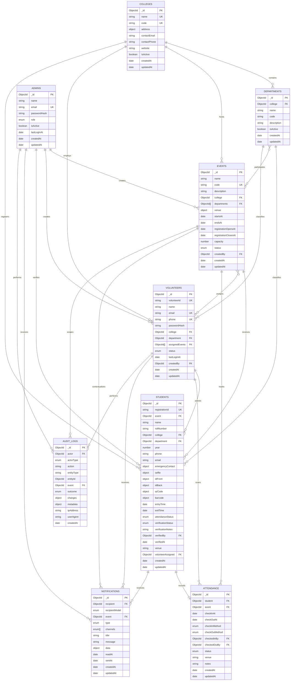

# EventPass AI Database Design

## Design decisions

MongoDB collection names are fixed explicitly in each Mongoose schema. ObjectId references preserve clear ownership while allowing high-volume attendance and audit data to grow independently.

A `Student` represents one student's registration for one event. This is important because identity details, generated admission codes, verification, venue assignment, and attendance state belong to a specific event registration. The separate `Attendance` collection is the authoritative check-in/check-out transaction record; the status and timestamps on `Student` are a read-optimized registration snapshot for dashboards and scanning.

MongoDB creates collections and indexes when models first write data or when Mongoose initializes indexes. Connecting to an empty database alone does not make the collections appear in Compass.

## Entity relationship diagram

## Duplicate registration prevention

Uniqueness is enforced by MongoDB, not only by application checks:

| Constraint | Unique index |
| --- | --- |
| Registration identifier | `students.registrationId` |
| Same roll number in one event | `{ event: 1, rollNumber: 1 }` |
| Same email in one event | `{ event: 1, email: 1 }` |
| Same phone in one event | `{ event: 1, phone: 1 }` |
| QR payload | `students.qrCode.value` |
| Barcode payload | `students.barcode.value` |
| One attendance record per event registration | `{ event: 1, student: 1 }` |

Email values are lowercased and roll numbers are uppercased before persistence, preventing case-only duplicates. Services should still catch MongoDB error code `11000` and return HTTP `409 Conflict`; the database indexes remain the final concurrency-safe guard.

## Validation rules

- Emails are normalized and checked for a valid address shape.
- Phone numbers use international E.164-style digits, with an optional leading `+`.
- Media and generated-code image URLs must use HTTPS and retain their Cloudinary public IDs.
- Event registration and event time windows must be chronological.
- Student exit time cannot exist without entry time or precede it.
- Checked-out attendance requires a check-out time and responsible volunteer.
- Years are integer values from 1 through 8.
- Capacity and geographic coordinates have bounded numeric ranges.
- Identifiers and status fields use length constraints and closed enums.
- Password hashes are excluded from queries by default.
- Registration identity references and audit data are immutable.
- Optimistic concurrency protects student and attendance state transitions from lost updates.

## Index summary

Beyond unique constraints, indexes support:

- event discovery by college, department, status, and date;
- registration review by event and verification state;
- attendance dashboards by event and status;
- volunteer scanning workloads;
- college/department/year reporting;
- unread notification feeds;
- chronological actor, entity, and event audit investigations.

Indexes improve supported queries but add write and storage cost. Query plans should be reviewed with production traffic before adding further indexes.

## Collection ownership

| Collection | Primary responsibility |
| --- | --- |
| `admins` | Administrative identities and permissions |
| `volunteers` | Scanner-app identities and event assignments |
| `students` | Event-specific student registration and current state |
| `events` | Event schedule, venue, capacity, and ownership |
| `attendance` | Authoritative check-in/check-out records |
| `departments` | College-scoped academic departments |
| `colleges` | Participating institutions and contact data |
| `notifications` | Multi-channel recipient messages and read state |
| `auditlogs` | Immutable security and operational activity trail |
| `registrationcounters` | Atomic, scoped student registration number sequences |
| `authsessions` | Hashed refresh-token sessions and remembered logins |
| `authotps` | Expiring password-reset and email-verification challenges |
